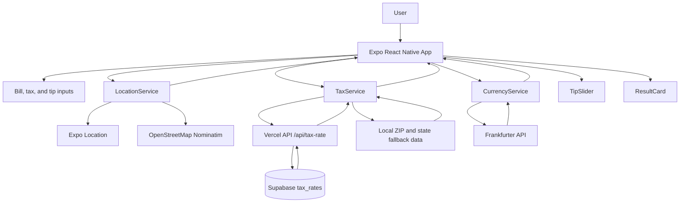

# Architecture

## Overview

Tip Calculator is an Expo application with a shared React Native UI for Web, iOS, and Android.
The main screen owns the calculation state and delegates external data access to service modules.



## Application Layer

### `App.tsx`

`App.tsx` is the main screen and the central state owner. It is responsible for:

- Keeping the bill, tax, tip, location, and exchange-rate state
- Loading the initial location and exchange rate
- Calculating tax, tip, and total values
- Handling direct edits to the tax amount or tax rate
- Handling the no-tip toggle
- Adjusting the tip when the user selects **Round**
- Rendering the header, inputs, tip controls, and result card

Important state values include:

| State | Purpose |
| --- | --- |
| `foodCost` | User-entered bill amount |
| `taxAmount` | Tax amount in USD |
| `taxRate` | Tax percentage used for calculations |
| `tipPercentage` | Current tip percentage |
| `locationState` | State returned by reverse geocoding |
| `zipCode` | ZIP Code returned by reverse geocoding |
| `exchangeRate` | USD to KRW exchange rate |
| `krwAmount` | Converted total in KRW |

## UI Components

### `TipSlider.tsx`

Provides the primary tip control. The current slider range is 10% to 25%, with 0% represented by the disabled no-tip state.

### `ResultCard.tsx`

Displays:

- Bill amount
- Tax amount
- Tip amount
- USD total
- Round button
- Exchange rate timestamp
- KRW total

### `TipDial.tsx`

Contains a circular gesture-based tip control implemented with SVG, Gesture Handler, and Reanimated. It is currently not imported or rendered by `App.tsx`.

## Location Flow

```text
Request foreground permission
        ↓
Read current GPS coordinates
        ↓
Reverse geocode coordinates
        ↓
Extract State and ZIP Code
        ↓
Pass State and ZIP Code to TaxService
```

Native platforms rely on Expo Location. On Web, the service attempts to use Expo Location and can use OpenStreetMap Nominatim as a fallback when reverse geocoding returns no usable region.

## Tax Flow

```text
App.tsx
   ↓
TaxService.getTaxRate(state, zip)
   ↓
GET /api/tax-rate?zip={zip}
   ↓
Vercel API route
   ↓
Supabase tax_rates table
   ↓
combined_rate
   ↓
TaxService converts decimal rate to percentage
   ↓
App.tsx calculates tax amount
```

The API route is responsible for querying Supabase. The client-side service is responsible for fallback data and converting the API response into the percentage format used by the UI.

## Currency Flow

```text
App total in USD
        ↓
CurrencyService.getExchangeRate('USD', 'KRW')
        ↓
Frankfurter API
        ↓
KRW exchange rate
        ↓
Rounded KRW total
```

## Backend and Data Layer

### Vercel API

`api/tax-rate.ts`:

1. Reads the `zip` query parameter.
2. Removes the ZIP+4 suffix, if present.
3. Queries the Supabase `tax_rates` table.
4. Returns the `combined_rate` value as `{ rate: ... }`.

### Supabase

The expected table is:

```sql
create table tax_rates (
  zip_code text primary key,
  state text,
  city text,
  combined_rate float
);
```

### Data seeding

`scripts/seed_taxes.js` reads CSV files from `tax_data/TAXRATES_ZIP5`, maps the source columns to the Supabase schema, and upserts records in batches.

The `tax_data/` directory is ignored by Git and must be supplied separately when running the seeding process.

## Build and Deployment Flow

```text
npm run build
        ↓
expo export -p web
        ↓
post-build viewport patch
        ↓
dist/
        ↓
Vercel deployment
```

The Vercel API route and Supabase environment variables must be configured independently of the static web bundle.
